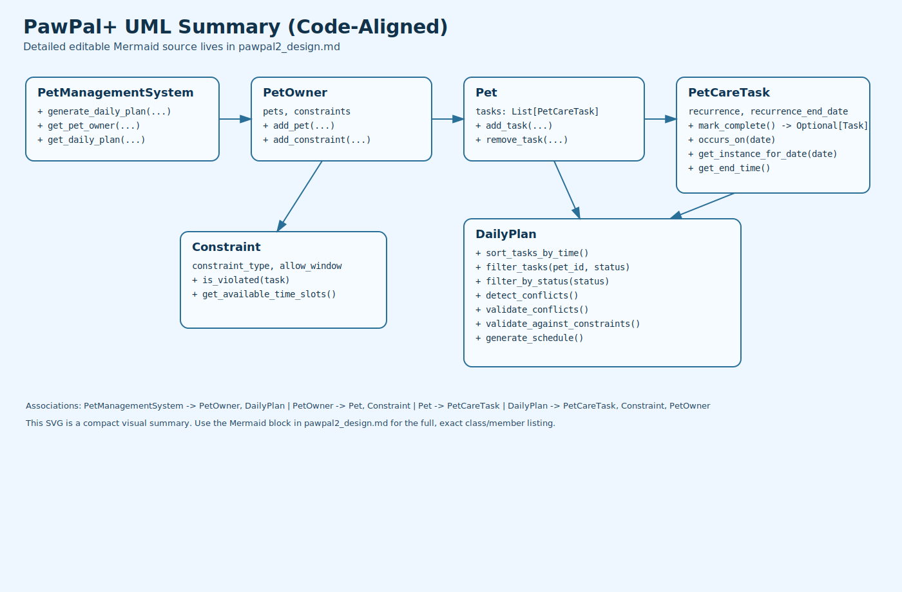
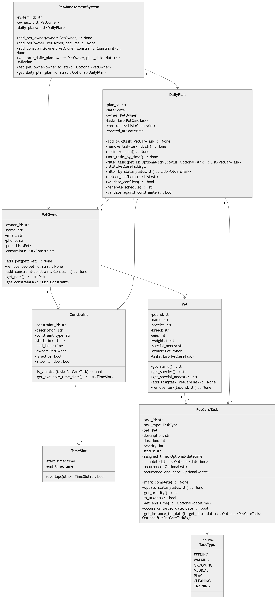
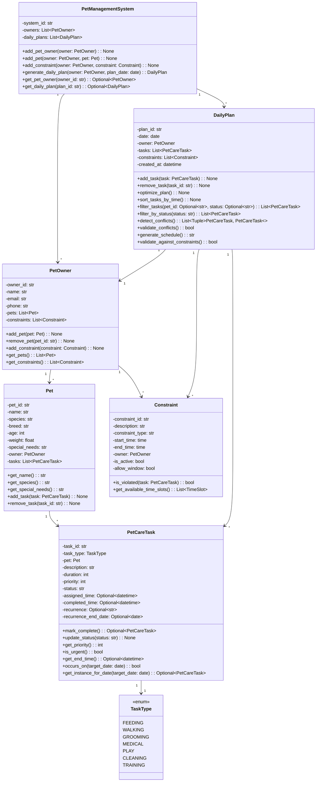

# PawPal+ Updated UML (Code-Aligned)

This design reflects the final implementation in pawpal_system.py, including recurrence support, conflict detection, sorting, and filtering methods.

## UML Diagram Image

## Mermaid Source (Editable)

