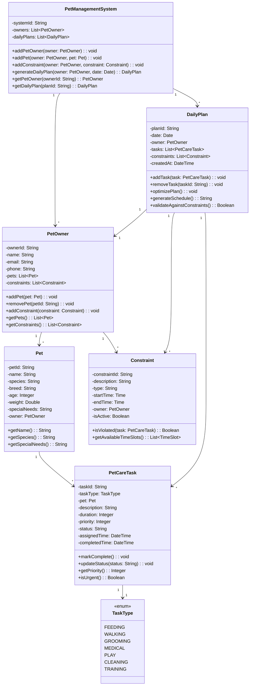

# Pawpal UML Class Diagram

```mermaid
classDiagram
    class TaskType {
        <<enum>>
        FEEDING
        WALKING
        GROOMING
        MEDICAL
        PLAY
        CLEANING
        TRAINING
    }

    class PetManagementSystem {
        -systemId: String
        -owners: List~PetOwner~
        -dailyPlans: List~DailyPlan~
        +addPetOwner(owner: PetOwner): void
        +addPet(owner: PetOwner, pet: Pet): void
        +addConstraint(owner: PetOwner, constraint: Constraint): void
        +generateDailyPlan(owner: PetOwner, date: Date): DailyPlan
        +getPetOwner(ownerId: String): PetOwner
        +getDailyPlan(planId: String): DailyPlan
    }

    class PetOwner {
        -ownerId: String
        -name: String
        -email: String
        -phone: String
        -pets: List~Pet~
        -constraints: List~Constraint~
        +addPet(pet: Pet): void
        +removePet(petId: String): void
        +addConstraint(constraint: Constraint): void
        +getPets(): List~Pet~
        +getConstraints(): List~Constraint~
    }

    class Pet {
        -petId: String
        -name: String
        -species: String
        -breed: String
        -age: Integer
        -weight: Double
        -specialNeeds: String
        -owner: PetOwner
        +getName(): String
        +getSpecies(): String
        +getSpecialNeeds(): String
    }

    class PetCareTask {
        -taskId: String
        -taskType: TaskType
        -pet: Pet
        -description: String
        -duration: Integer
        -priority: Integer
        -status: String
        -assignedTime: DateTime
        -completedTime: DateTime
        +markComplete(): void
        +updateStatus(status: String): void
        +getPriority(): Integer
        +isUrgent(): Boolean
    }

    class Constraint {
        -constraintId: String
        -description: String
        -type: String
        -startTime: Time
        -endTime: Time
        -owner: PetOwner
        -isActive: Boolean
        +isViolated(task: PetCareTask): Boolean
        +getAvailableTimeSlots(): List~TimeSlot~
    }

    class DailyPlan {
        -planId: String
        -date: Date
        -owner: PetOwner
        -tasks: List~PetCareTask~
        -constraints: List~Constraint~
        -createdAt: DateTime
        +addTask(task: PetCareTask): void
        +removeTask(taskId: String): void
        +optimizePlan(): void
        +generateSchedule(): String
        +validateAgainstConstraints(): Boolean
    }

    PetManagementSystem "1" --> "*" PetOwner
    PetManagementSystem "1" --> "*" DailyPlan
    PetOwner "1" --> "*" Pet
    PetOwner "1" --> "*" Constraint
    Pet "1" --> "*" PetCareTask
    PetCareTask "1" --> "1" TaskType
    DailyPlan "1" --> "*" PetCareTask
    DailyPlan "1" --> "*" Constraint
    DailyPlan "1" --> "1" PetOwner

```